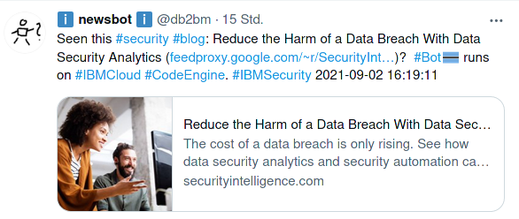

# TwitterBot for IBM Cloud Code Engine
Some fun and experiments with Golang, Twitter and IBM Cloud Code Engine. Tweet at schedule with the message composed of latest IBM Cloud blog entries.



Read more:
- [cron-like scheduling on IBM Cloud](https://blog.4loeser.net/2021/03/cron-like-scheduling-on-ibm-cloud.html)
- [The Time for Events: Cron-like Jobs in the Cloud](https://www.ibm.com/cloud/blog/the-time-for-events-cron-like-jobs-in-the-cloud)
- [Serverless Twitter Bot using IBM Cloud](https://blog.4loeser.net/2021/09/serverless-twitter-bot-ibm-cloud.html)


## (Rough) Instructions

1. Set up a [Code Engine (CE) project](https://cloud.ibm.com/docs/codeengine?topic=codeengine-manage-project).
2. [Add access to a container registry](https://cloud.ibm.com/docs/codeengine?topic=codeengine-add-registry) in Code Engine.
3. Configure a local file **.env** with credentials / secrets. Check [.env.template](.env.template) for a template.
4. [Create a secret](https://cloud.ibm.com/docs/codeengine?topic=codeengine-configmap-secret#secret-create) from file.
5. Build the container image, either in CE or using the Container Registry
6. [Create the CE job](https://cloud.ibm.com/docs/codeengine?topic=codeengine-cli#cli-application-create) from the image and pass the configured secrets / credentials.
7. Set up the [CE cron subscription](https://cloud.ibm.com/docs/codeengine?topic=codeengine-subscribe-cron-tutorial) and pass the parameters as environment variables, e.g., 
   ```
   ibmcloud ce sub cron create -n tweety --destination twitterbot --schedule '07 4,8,13,17 * * *' --content-type 'application/json'
   ```
   or
   ```
   ibmcloud ce sub cron create -n tweety --destination twitterbot --data
    '{"tweet_string2":"Written in #Golang by @data_henrik and running on #IBMCloud #CodeEngine", "item_range":10}' 
    --content-type 'application/json' --schedule '07 9,17 * * *'
   ```

### Local testing
1. configure **.env** based on [.env.template](.env.template)
2. `go build` to compile the program
3. Run `./twitterBot` or for only printing the message for the tweet: `./twitterBot --debug`
4. You can modify the parameters by setting individual environment variables (see the file **.env**) or just **CE_DATA**. `CE_DATA='{"feed":"https://blog.4loeser.net/feeds/posts/default","tweet_string1":"@data_henrik recently wrote about %s. The #blog post is available at %s. "}' ./twitterBot --debug`
